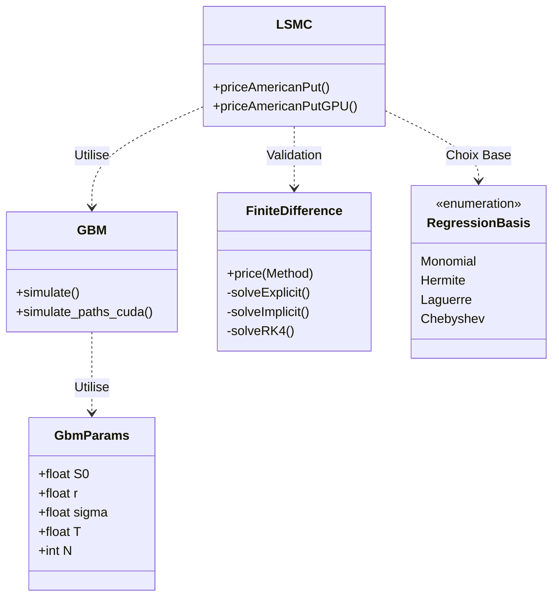

```mermaid
classDiagram
    class LSMC {
        +priceAmericanPut()
        +priceAmericanPutGPU()
    }

    class GBM {
        +simulate()
        +simulate_paths_cuda()
    }

    class GbmParams {
        +float S0
        +float r
        +float sigma
        +float T
        +int N
    }

    class FiniteDifference {
        +price(Method)
        -solveExplicit()
        -solveImplicit()
        -solveRK4()
    }

    class RegressionBasis {
        <<enumeration>>
        Monomial
        Hermite
        Laguerre
        Chebyshev
    }

    LSMC ..> GBM : Utilise
    LSMC ..> RegressionBasis : Choix Base
    LSMC ..> FiniteDifference : Validation
    GBM ..> GbmParams : Utilise
```
